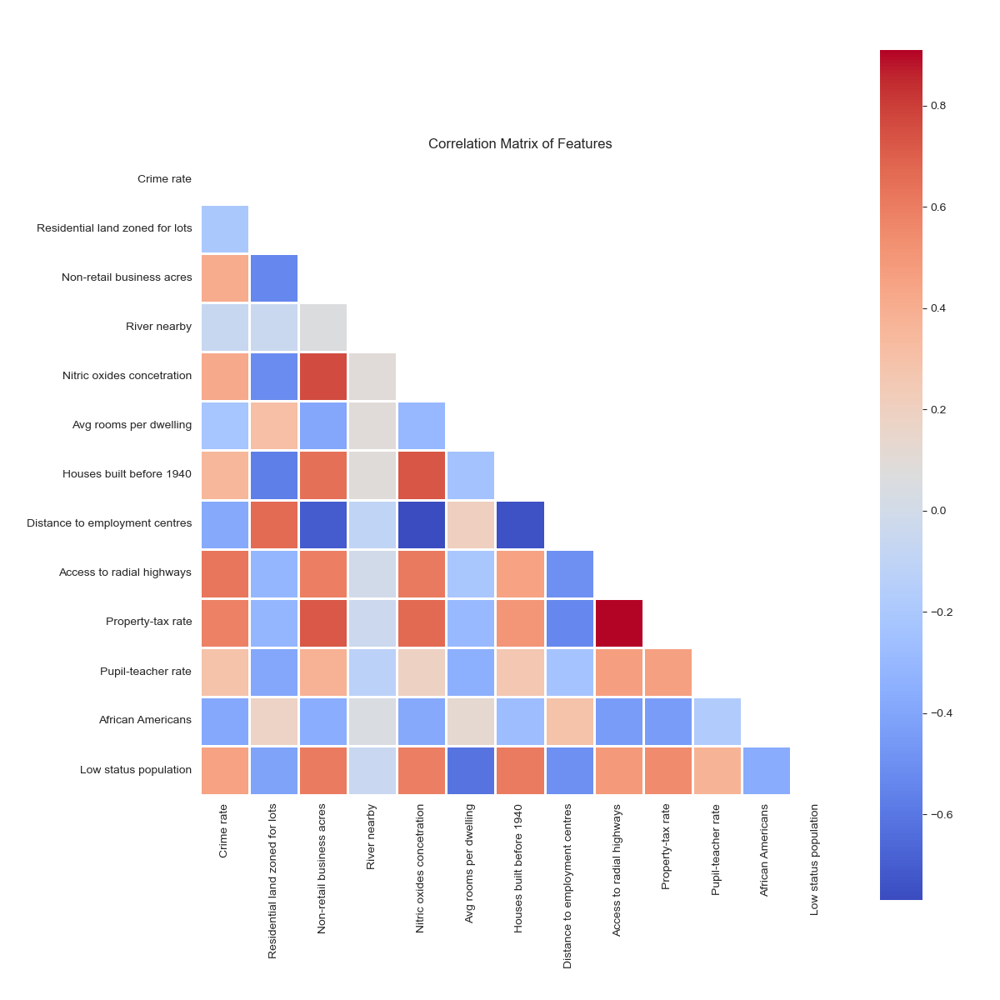
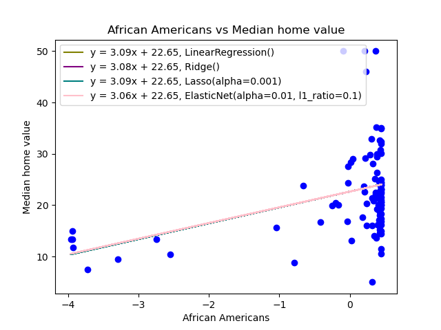

## Introduction

Regression analysis is a fundamental statistical technique used to model the relationship between a dependent variable and one or more independent variables. The goal is to find the best-fitting line or curve that describes the relationship between the variables. The least squares method is a widely used approach for estimating the parameters of a regression model by minimizing the sum of squared residuals (differences between the observed and predicted values).

In your project, you have explored several regression techniques and hyperparameter tuning methods for finding the optimal model parameters. Here's a brief overview of the techniques you've used:

### Regression Techniques

1. **Linear Regression**: This is the simplest and most commonly used regression technique. It assumes a linear relationship between the dependent variable and the independent variables.

2. **Ridge Regression**: Ridge regression is a type of regularized linear regression that introduces a penalty term to the cost function, which helps to address multicollinearity (high correlation among independent variables) and prevent overfitting.

3. **Lasso Regression**: Lasso (Least Absolute Shrinkage and Selection Operator) regression is another regularized linear regression technique that adds a penalty term to the cost function. Unlike ridge regression, lasso can effectively perform feature selection by shrinking some coefficients to exactly zero.

4. **Elastic Net Regression**: Elastic Net is a hybrid technique that combines the strengths of both ridge and lasso regression. It introduces two penalty terms to the cost function, allowing for feature selection while also addressing multicollinearity.

### Hyperparameter Tuning Methods

To find the optimal hyperparameters (parameters that are not learned from the data but must be set before the model is trained) for your regression models, you have employed the following techniques:

1. **Grid Search**: Grid search is a brute-force approach that exhaustively searches through a predefined range of hyperparameter values to find the best combination.

2. **Random Search**: Random search is a more efficient alternative to grid search, where hyperparameter values are randomly sampled from a specified distribution.

3. **Bayesian Optimization**: Bayesian optimization is a sequential model-based approach that uses prior information about the objective function to intelligently choose the next set of hyperparameters to evaluate, aiming to find the optimal values with fewer iterations.

By exploring these techniques, you have aimed to find the best regression model and hyperparameters for your specific problem, balancing predictive performance, model complexity, and computational efficiency.

### Datasets used in the project:
1. Students Dataset: This dataset likely contains information about students applying for admission. 
   - General Test Score (GRE): This is likely a standardized test score used for admission to graduate programs, assessing a student's verbal and quantitative reasoning skills.
   - English test (TOEFL): The Test of English as a Foreign Language (TOEFL) score, which measures the English language proficiency of non-native English speakers.
   - University Rating: A rating or ranking of the university to which the student is applying, which may reflect the institution's reputation, research output, or other factors.
   - Recruitment Essay (SOP): A score or evaluation of the student's statement of purpose or personal statement, which is often used to assess their motivation, goals, and fit for the program.
   - Recommendation Letter (LOR): A score or rating of the recommendation letters provided by the student, typically written by professors or employers.
   - Cumulative Grade (CGPA): The student's cumulative grade point average, which represents their academic performance throughout their undergraduate studies.
   - Research: This feature may indicate whether the student has prior research experience or not, or it could be a score or rating of their research background.
   - Chance of Admit: The target variable, indicating the probability or likelihood of the student being admitted to the program based on the other features.
2. Boston Housing Dataset: A classic dataset from the UCI Machine Learning Repository, which includes various features related to housing in the Boston area.
   - CRIM: Per capita crime rate by town
   - ZN: Proportion of residential land zoned for lots over 25,000 sq. ft.
   - INDUS: Proportion of non-retail business acres per town
   - CHAS: Charles River dummy variable (1 if tract bounds river; 0 otherwise)
   - NOX: Nitric oxides concentration (parts per 10 million)
   - RM: Average number of rooms per dwelling
   - AGE: Proportion of owner-occupied units built prior to 1940
   - DIS: Weighted distances to five Boston employment centers
   - RAD: Index of accessibility to radial highways
   - TAX: Full-value property tax rate per $10,000
   - PTRATIO: Pupil-teacher ratio by town
   - B: 1000(Bk - 0.63)^2 where Bk is the proportion of Black residents by town
   - LSTAT: Percentage of lower status of the population
   - MEDV: Median value of owner-occupied homes in $1000s - The target variable to predict.
3. Diabetes Dataset: A dataset containing various health-related features and the blood sugar lever of patients:
   - Age: The age of the individual.
   - Sex: The gender of the individual (e.g., male or female).
   - BMI: The body mass index, which is a measure of body fat based on height and weight.
   - Mean Arterial Pressure: The average arterial pressure, which is related to blood pressure.
   - Total Cholesterol: The total cholesterol level in the individual's blood.
   - Low-Density Lipoprotein: The level of low-density lipoprotein (LDL) cholesterol, often referred to as "bad" cholesterol.
   - High-Density Lipoprotein: The level of high-density lipoprotein (HDL) cholesterol, often referred to as "good" cholesterol.
   - Triglycerides: The level of triglycerides in the individual's blood, which are a type of fat.
   - Laminar Thickness of Glucose: This feature may represent a measure of glucose concentration or distribution in the body.
   - Blood Glucose Level: The level of glucose in the individual's blood.
   - Blood Sugar Level: Another measure of blood sugar level, which may be related to or redundant with the "Blood Glucose Level" feature.
## Evaluation Metrics
1. Test and Train R2 Score: The R2 score, also known as the coefficient of determination, is a measure of how well the regression model fits the observed data. It ranges from 0 to 1, with 1 indicating a perfect fit.
2. Root Mean Squared Error (RMSE): The RMSE is a measure of the differences between the predicted and observed values in the units of the dependent variable. It provides an estimate of the model's prediction error, with lower values indicating better performance.
3. Cross-Validation Score: Cross-validation is a resampling technique used to evaluate the performance of a machine learning model on a limited data sample. The cross-validation score provides an estimate of the model's generalization performance on unseen data.

Sure, here's how you can describe the important parts of this code in your README.md:

## Code Overview

The code performs regression analysis on a given dataset, exploring various regression techniques and hyperparameter tuning methods. Here are the key components:

### Data Preprocessing

1. **Loading the Dataset**: The code loads the dataset from a CSV file specified by the `filename` variable (`boston`, `students`, or `diabetes`).

2. **Splitting the Data**: The dataset is split into training and test sets using `train_test_split` from scikit-learn.

3. **Feature Scaling**: The training data is standardized by subtracting the mean and dividing by the standard deviation of each feature. The test data is scaled using the same mean and standard deviation values from the training set.

### Feature Analysis

The code generates a correlation matrix plot showing the correlation between features in the dataset. This plot is saved as `correlation_matrix.png` in the `research` subdirectory.

Additionally, for each feature, the code generates a scatter plot of the feature versus the target variable, along with regression lines for different models (Linear Regression, Ridge, Lasso, and ElasticNet). These plots are saved in the `features` subdirectory with filenames in the format `<feature_name>_vs_<target_variable>.png`.

### Model Evaluation

The code evaluates the performance of the following regression models:

- Linear Regression
- Ridge Regression
- Lasso Regression
- ElasticNet Regression

For Ridge, Lasso, and ElasticNet, the code performs hyperparameter tuning using GridSearchCV with different values of the regularization parameter `alpha` (and `l1_ratio` for ElasticNet).

The performance of each model is evaluated using the following metrics:

- Test Score (R-squared on the test set)
- Train Score (R-squared on the training set)
- Root Mean Squared Error (RMSE)
- Cross-Validation Score (using 10-fold cross-validation and negative RMSE as the scoring metric)

The results are stored in a pandas DataFrame and printed to the console.

### Visualization

The code generates several plots to visualize the performance of the models:

- Actual vs. Predicted plots for each model, saved as `actual_vs_predicted_<model_name>.png` in the `research` subdirectory.
- Bar plots for Test Scores, Train Scores, RMSE, and Cross-Validation Scores, saved as `test_scores.png`, `train_scores.png`, `rmse.png`, and `cross_validation_scores.png`, respectively, in the `research` subdirectory.

These visualizations can help you understand the behavior and performance of the different models.

### Dependencies

The code requires the following Python libraries:

- scikit-learn
- NumPy
- Pandas
- Matplotlib
- Seaborn

Make sure to install these libraries before running the code.

## Results

The code provides insights into the performance of different regression models on the given dataset. By analyzing the correlation between features, visualizing the relationship between features and the target variable, and evaluating the models using various metrics, you can identify the best regression technique and hyperparameters for your specific problem.
A correlation matrix is a table showing correlation coefficients between variables. Each cell in the table shows the correlation between two variables. The value is in the range of -1 to 1. If two variables have high correlation, we can neglect one variable from those two. If two variables have low correlation, we can consider both variables. If two variables have negative correlation, we can consider both variables. If two variables have positive correlation, we can neglect one variable from those two.
Correlation matrix for the Boston Housing dataset:

Scatter plots of features vs. target variable (MEDV) for the Boston Housing dataset:

